# HangTruyen - Website Đọc Truyện Tranh Online

Hangtruyen - Website đọc truyện tranh online miễn phí được xây dựng trên nền tảng Laravel, mang đến trải nghiệm đọc truyện mượt mà, tốc độ tải nhanh và giao diện hiện đại.

## Giới thiệu

Website sử dụng API từ [OTruyen API](https://docs.otruyenapi.com/) để đồng bộ dữ liệu truyện khổng lồ, kết hợp với hệ thống quản trị chuyên nghiệp giúp vận hành website dễ dàng.

## Hình ảnh Demo & Tính năng

### 1. Giao diện Người dùng (Frontend)

*   **Trang chủ:** Thiết kế hiện đại, tinh tế với các mục truyện đề xuất, truyện mới cập nhật và bảng xếp hạng.
    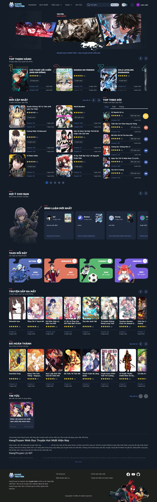

*   **Truyện nổi bật:** Tổng hợp các bộ truyện hot nhất theo tuần, tháng và mọi thời đại.
    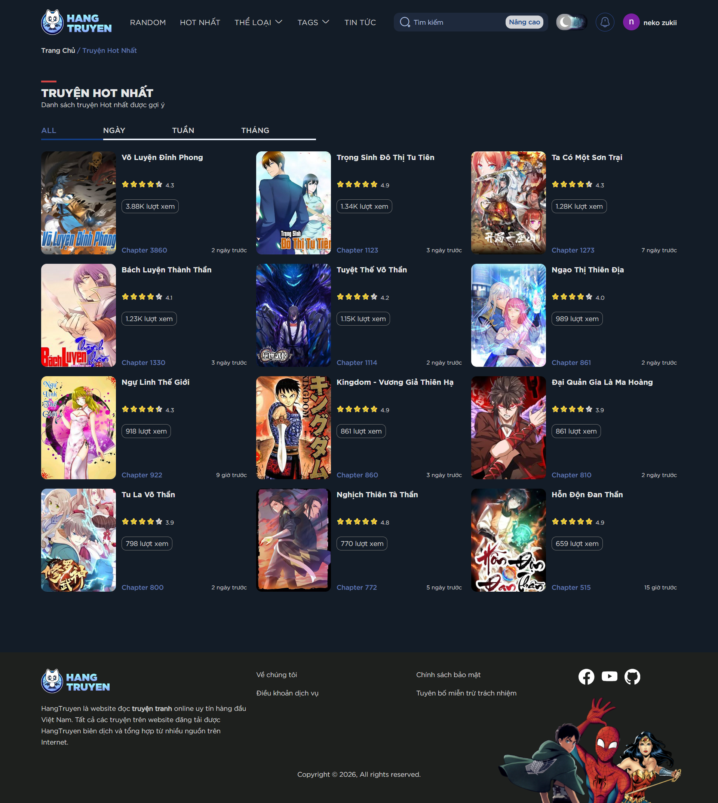

*   **Chi tiết truyện:** Hiển thị thông tin chi tiết, danh sách chương, bình luận và đánh giá từ người dùng.
    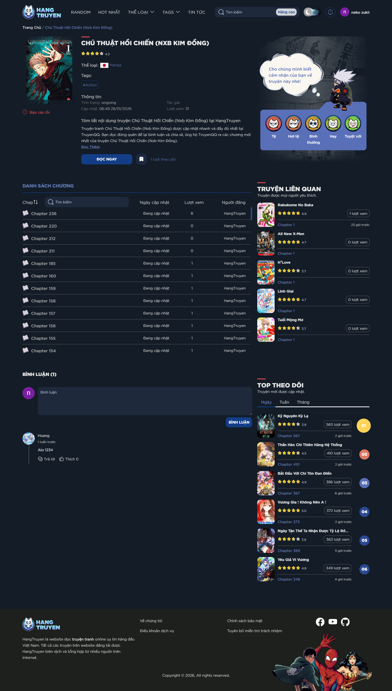

*   **Trình đọc truyện (Reader):** Tối ưu hóa cho cả desktop và mobile, hỗ trợ nhiều chế độ đọc, tải ảnh nhanh.
    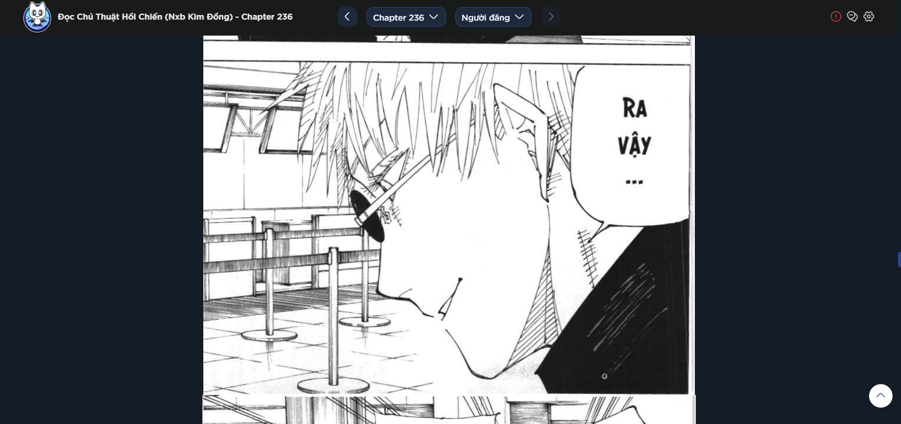

*   **Tìm kiếm thông minh:** Tìm kiếm truyện nhanh chóng với gợi ý tức thì.
    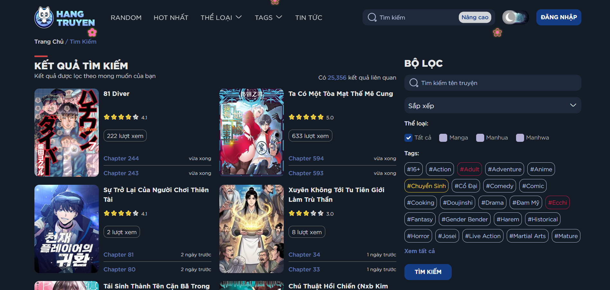
    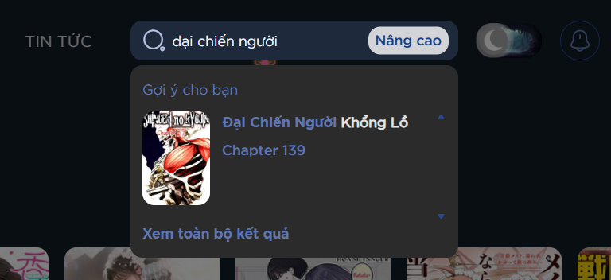

### 2. Giao diện Quản trị (Admin Panel)

Hệ thống Admin được xây dựng với đầy đủ các tính năng cần thiết để quản trị nội dung và cấu hình website:

*   **Dashboard:** Thống kê tổng quan về truyện, bài viết, người dùng và báo lỗi.
    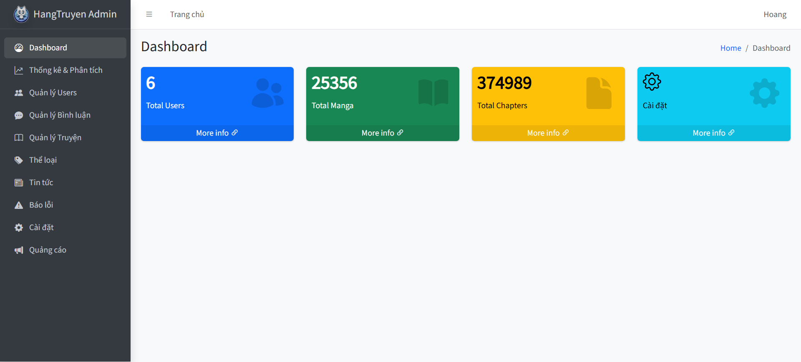

*   **Quản lý Quảng cáo:** Hệ thống quản lý quảng cáo linh hoạt với nhiều vị trí hiển thị (Popunder, Banner, Sticky...).
    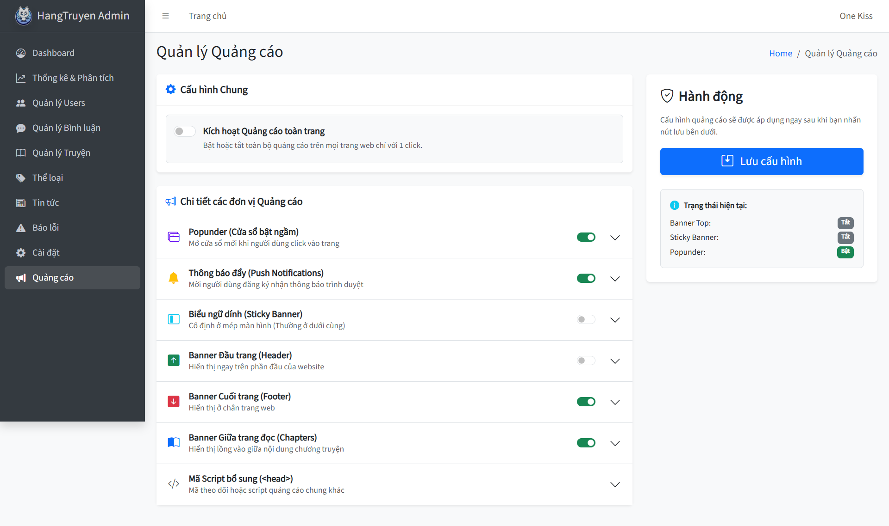

*   **Cấu hình Website:** Tùy chỉnh linh hoạt giao diện, SEO, tài khoản xã hội và các hiệu ứng đặc biệt.
    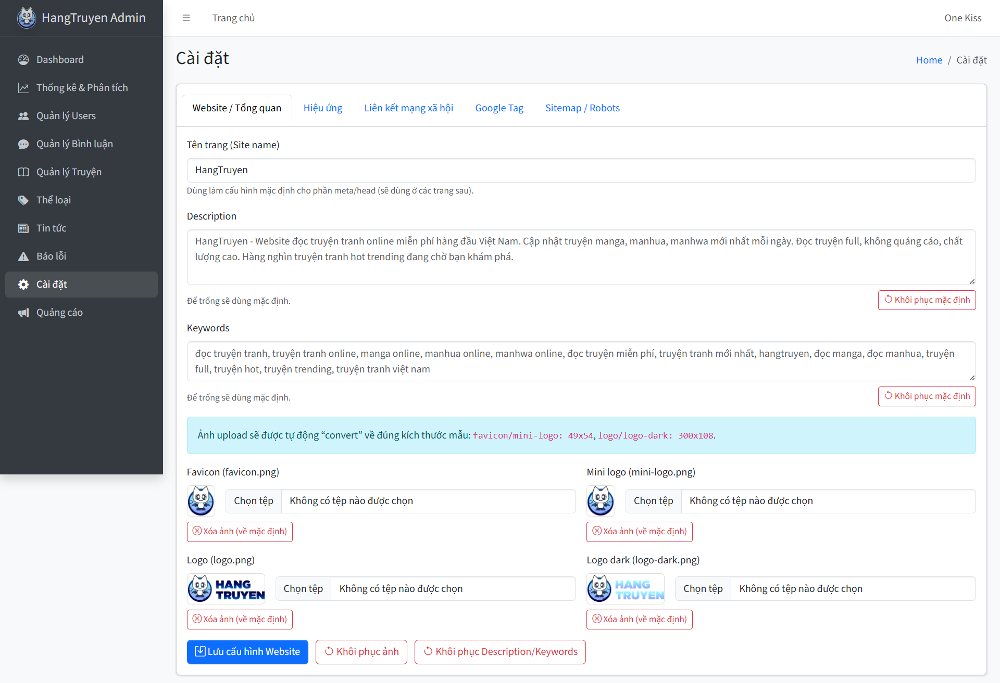
    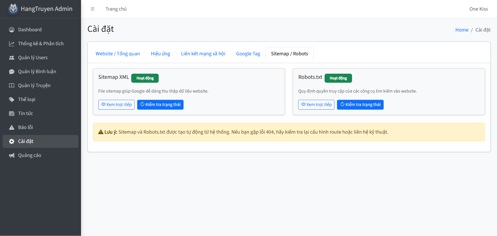

*   **Quản lý Báo lỗi:** Tiếp nhận và xử lý các báo lỗi từ người dùng (ảnh lỗi, sai chương...).
    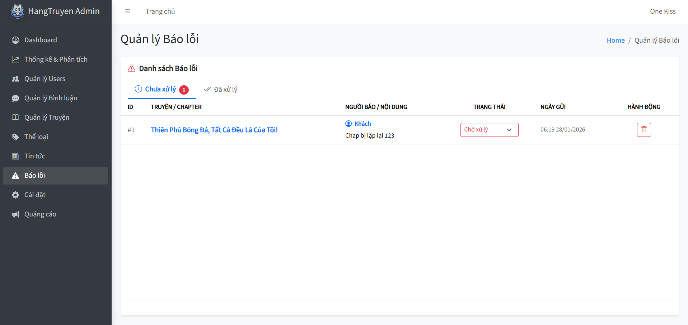

*   **Quản lý Bài viết & Tin tức:** Hệ thống đăng bài viết, tin tức manga với trình soạn thảo Rich Text.
    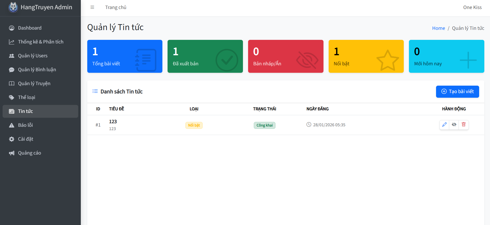
    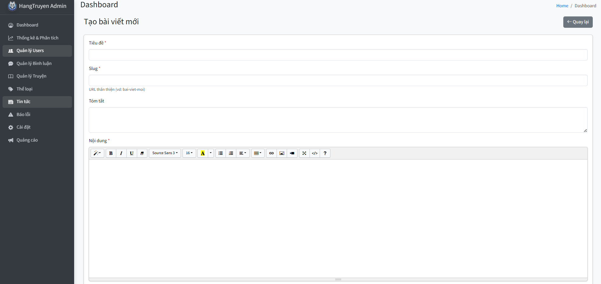

*   **Quản lý Người dùng:** Theo dõi và quản trị danh sách người dùng trên hệ thống.
    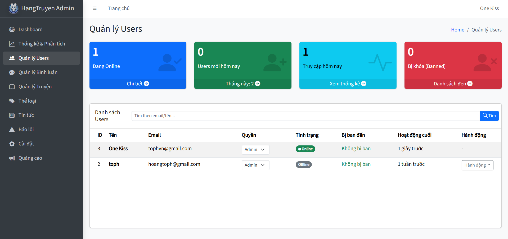

## Yêu cầu hệ thống

- PHP >= 8.0
- Composer
- MySQL >= 5.7 hoặc MariaDB >= 10.2
- Node.js và NPM (cho frontend assets)
- Web server (Apache/Nginx) hoặc PHP built-in server

## Cài đặt

### 1. Clone repository

```bash
git clone https://github.com/tophvn/hangtruyen_source.git
cd hangtruyen_source
```

### 2. Cài đặt dependencies

```bash
composer install
npm install
```

### 3. Cấu hình môi trường

Sao chép file `.env.example` thành `.env`:

```bash
cp .env.example .env
```

Tạo APP_KEY:

```bash
php artisan key:generate
```

### 4. Cấu hình file .env

Mở file `.env` và cấu hình các thông tin sau:

#### Cấu hình ứng dụng cơ bản

```env
APP_NAME=HangTruyen
APP_ENV=local          # local, staging, production
APP_KEY=               # Tự động tạo sau khi chạy php artisan key:generate
APP_DEBUG=true         # false trên production
APP_URL=http://localhost
```

#### Cấu hình Database

```env
DB_CONNECTION=mysql
DB_HOST=127.0.0.1      # Địa chỉ MySQL server
DB_PORT=3306           # Port MySQL (mặc định 3306)
DB_DATABASE=hangtruyen # Tên database
DB_USERNAME=root       # Username MySQL
DB_PASSWORD=           # Password MySQL
```

**Lưu ý:** Đảm bảo đã tạo database trước khi chạy migrations.

#### Cấu hình Google OAuth

```env
GOOGLE_CLIENT_ID=your-google-client-id
GOOGLE_CLIENT_SECRET=your-google-client-secret
GOOGLE_REDIRECT_URI=http://localhost:8000/auth/google/callback
```

### Chạy ứng dụng

**Development:**

```bash
php artisan serve
```

Truy cập: `http://localhost:8000`

**Production:**

Cấu hình web server (Apache/Nginx) trỏ đến thư mục `public/`


## License

MIT or project-specific; see repository terms.